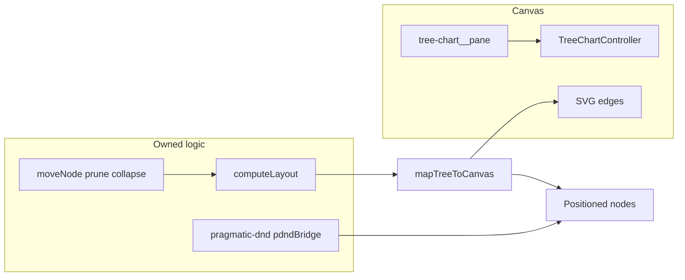

# Tree Chart Library

React 17 + TypeScript component library for an infinite-canvas tree chart with smart drag-and-drop and auto-layout.

- Storybook (GitHub Pages): <https://samchliu.github.io/react-tree-chart/>

## Tech Stack

- Rendering: custom pan/zoom viewport + SVG edges (no React Flow)
- Interaction: `@atlaskit/pragmatic-drag-and-drop`
- Layout: `d3-hierarchy`
- Styling: `CSS Modules`
- Build: `tsup` (`esm` + `cjs` + `d.ts`)

## Viewport (replacing React Flow)

The chart uses an internal **`TreeChartViewport`**: CSS `translate` + `scale`, wheel / pinch / double-click zoom, drag-to-pan, and `fitView` with optional animation. Parent–child links are **SVG paths** from layout geometry (parent bottom-center → child top-center). `TreeChartController` exposes `fitView`, `zoomIn`, `zoomOut`, `getViewport`, and `setViewport` (no `ReactFlowInstance`).

**Pane class for DnD:** the scrollable surface has class `tree-chart__pane`. `bindNodeDragAndDrop` ignores hover events when the pointer is reported on that pane (same idea as the old `react-flow__pane` check).

**No-pan regions:** node shells use classes `tree-chart__nopan` and `nopan` so dragging a node does not pan the canvas.



## Compatibility

- `peerDependencies`
  - `react: >=17 <18`
  - `react-dom: >=17 <18`
- Recommended for consumer projects that are still on React 17.

## Development

```bash
yarn
yarn build
yarn test
yarn storybook
```

## Exported APIs

- Components / Hooks
  - `TreeChart`
  - `TreeChartNode`
  - `TreeChartDropZoneOverlay`
  - `useTreeChartController`
- Layout / DnD / Tree utilities
  - `computeLayout`
  - `resolveNodeWidth`
  - `detectDropIntent`
  - `bindNodeDragAndDrop`
  - `moveNode`
  - `canMoveNode`
  - `indexTreeById`
- Types
  - `TreeChartNodeProps`
  - `LayoutOptions`, `LayoutResult`, `PositionedNode`
  - `BindNodeDragAndDropOptions`
  - `FitViewOptions`, `TreeChartController`, `Viewport`
  - `DropIntent`, `DropIntentMode`
  - `TreeChartProps`, `TreeChartRenderNodeProps`
  - `TreeNodeData`, `TreeNodeModel`

## Acceptance Mapping (from PRD)

- Zoom/pan/fit-view: custom viewport (`TreeChartViewport`).
- Child/sibling/forbidden intent: `detectDropIntent`.
- Illegal path block (parent -> descendant): `canMoveNode`.
- Auto-format after drop: `moveNode` + `computeLayout` + `fitView`.
